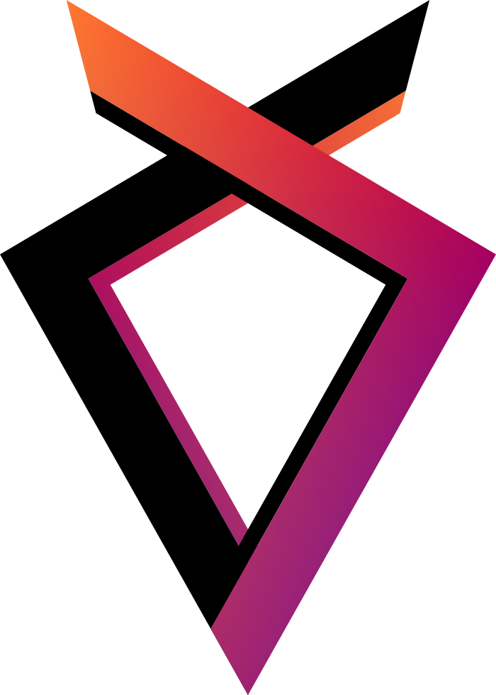

<h1>Shift</h1>

Domain driven API framework written in Golang

> :warning: **Solution currently unusable and in active development.**

## Idea

Framework is based on idea of fully code-separated domains.
The main benefit of such an approach would be the opportunity
to work with a monolithic codebase in the early stages of the
project and, over time, to move gradually towards architecture
based on microservices. See [project workflow graph](./media/workflow.png).

## Inter-domain communication

Ultimately, the framework is intended to provide tools
for inter-domain communication which will allow
automatic switching from in-memory communication
towards network-based communication between services
located on separate instances.

## What's next

Please note that framework is in very early stage so some basic components and features are still not there.

These parts are next in line:

- project & code documentation
- logging
- unit tests (including \_examples/)
- e2e bdd-style tests (including \_examples/)
- benchmarks

More about future plans soon
on project documentation page (in progress)
but right now please see [todo.md](./todo.md).
